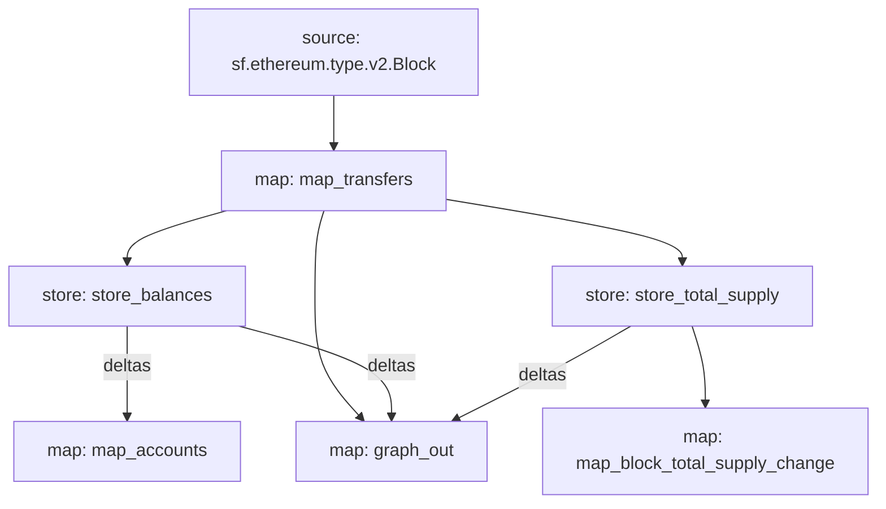

# GRT Subgraph fed by Substreams

Substreams based GRT subgraph and substreams. 

[](https://opensource.org/licenses/Apache-2.0)

## Introduction 

This project is a [subgraph](https://thegraph.com/docs/en/developing/creating-a-subgraph/) fed by [substreams](https://substreams.streamingfast.io/) that allows you to obtain data for The Graph's token, GRT. 

## Features 

### Available Data 

This subgraph makes available the following data:
- Total supply of GRT, 
- GRT balances of addresses

### Substreams Module Graph

Here is the graph of the modules of the substreams: 




## Quickstart
To build and run the substream, 

1. [Install dependencies](https://substreams.streamingfast.io/developers-guide/installation-requirements).
2. [Get authentication](https://substreams.streamingfast.io/reference-and-specs/authentication).
3. Clone this repo
```console
git clone https://github.com/sahra-karakoc/grt-substreams-subgraph.git
```
4. Code gen with 
```console
substreams protogen ./substreams.yaml
``` 
5. Build the substream with 
```console
cargo build --target wasm32-unknown-unknown --release
``` 
6. Run the graph_out module with
```console
substreams run -e mainnet.eth.streamingfast.io:443 \
substreams.yaml \
graph_out \
--start-block 11446769
```

## Contributing

We welcome and appreciate your contributions! Please see the [Contributor Guide](/CONTRIBUTING.md), [Code Of Conduct](/CODE_OF_CONDUCT.md) and [Security Notes](/SECURITY.md) for this repository.
